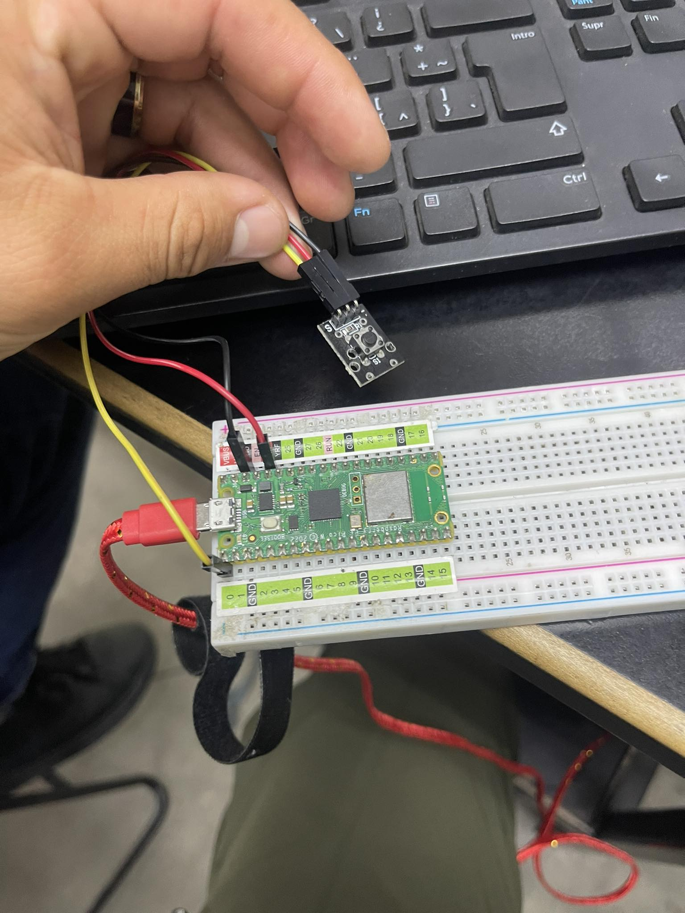

# KY-004 Button

Código:

```python

#Beny Samuel Pantoja Reyes 19211703
# Button

import machine

button_pin = machine.Pin(0, machine.Pin.IN, machine.Pin.PULL_UP)

def button_pressed(pin):
    print("Botón presionado")

button_pin.irq(trigger=machine.Pin.IRQ_FALLING, handler=button_pressed)

while True:
    pass
```

# Foto


