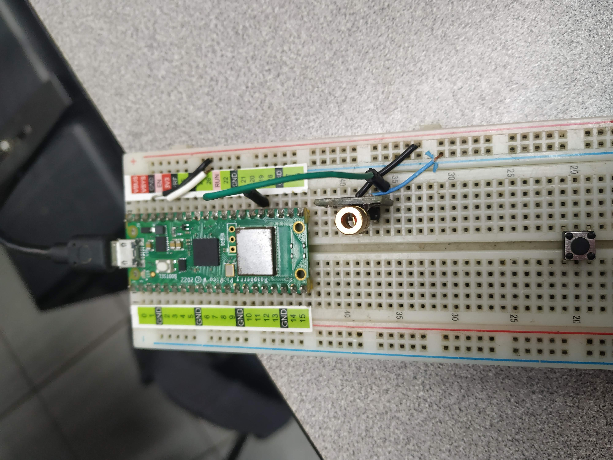

# KY-008 Laser Emit

Código:

```python

#Beny Samuel Pantoja Reyes 19211703
# Laser Emit

from machine import Pin
import time

sensor_pin = Pin(14, Pin.OUT)

while True:
    print("Prendido")
    sensor_pin.on()
    time.sleep(0.2)
    sensor_pin.off()
    print("Apagado")
    time.sleep(0.2)
```

# Foto


