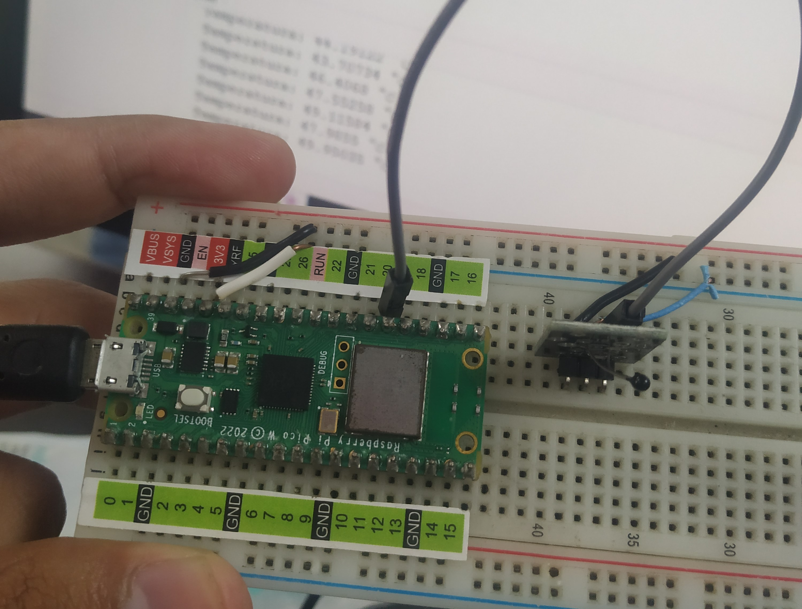

#ANALOG TEMP  KY-013

Código:

```python

#Beny Samuel Pantoja Reyes 19211703
# ANALOG TEMP

import machine
from utime import sleep
from math import log


sensor_temperatura = machine.ADC(26)
c1 = 0.001129148
c2 = 0.000234125
c3 = 0.0000000876741
R1 = 10000.0

while True:
    R2 = R1 / (65535 / (float(sensor_temperatura.read_u16()) - 1))
    logR2 = log(R2)
    temperatura = (1.0 / (c1 + c2*logR2 + c3*logR2*logR2*logR2))-281.10
    print('Temperatura: ' + str(temperatura) + ' °C')
    sleep(2)

```

# Foto


