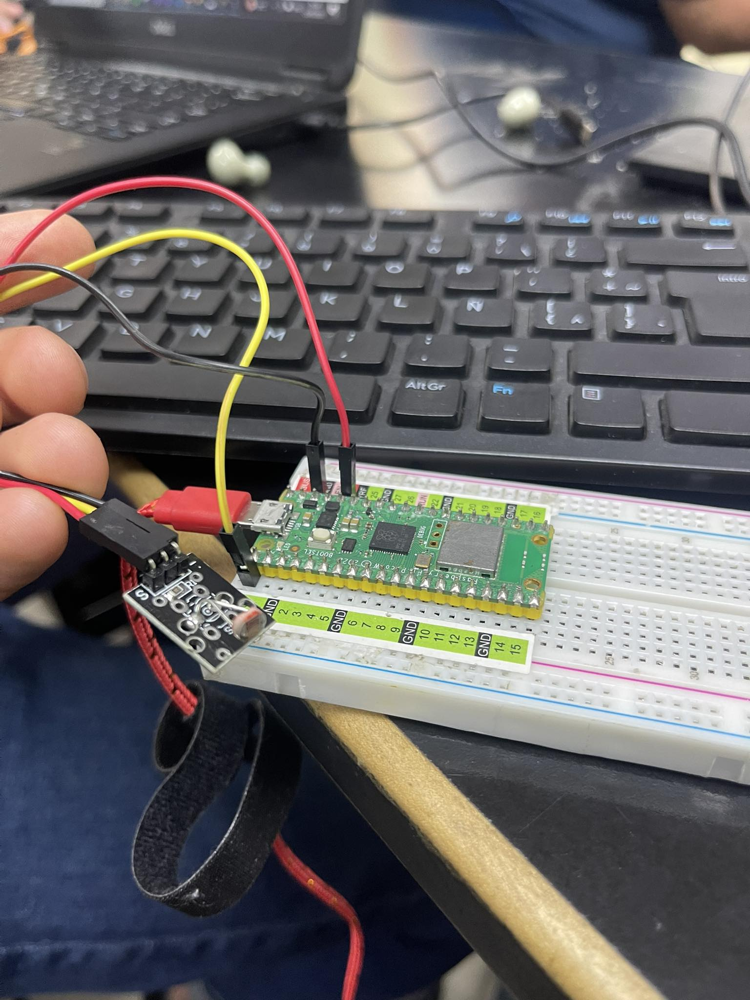

# KY-018 Photoresistor

Código:

```python

#Beny Samuel Pantoja Reyes 19211703
# KY-018 Photoresistor

import machine
import time
adc = machine.ADC(0) # Configura el pin del sensor como entrada analógica
while True:
    value = adc.read_u16() # Lee el valor del sensor

    print("Valor del fotoresistor: ", value)

    time.sleep(1) # Espera 1 segundo
```

## Foto


