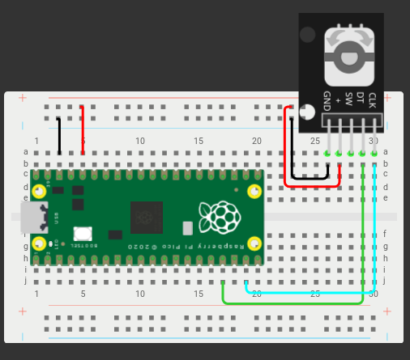

# KY-040 ROTARY ENCONDER

Código:

```python

#Beny Samuel Pantoja Reyes 19211703
# KY-040

rotary = Rotary(13, 14, 0)
val = 0

def rotary_changed(change):
    global val
    if change == Rotary.ROT_CW:
        val = val + 1
        print(val)
    elif change == Rotary.ROT_CCW:
        val = val - 1
        print(val)
    elif change == Rotary.SW_PRESS:
        print('PRESS')
    elif change == Rotary.SW_RELEASE:
        print('RELEASE')

rotary.add_handler(rotary_changed)

while True:
    time.sleep(0.1)


```

## Diagrama


